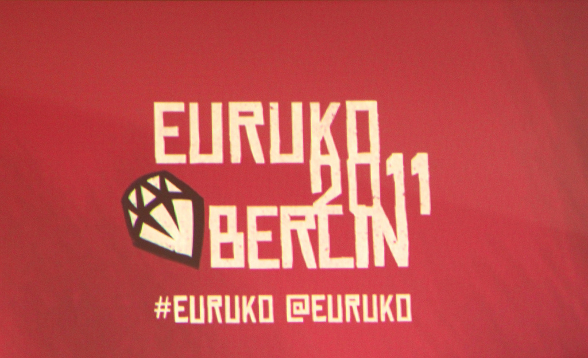

!SLIDE 
# Euruko 2011 summary #

!SLIDE center

!SLIDE center

!SLIDE
## Ruby helps us make movies: Guerilla-DI, scripted tools for a modern film pipeline
### Julik Tarkhanov

!SLIDE
## JRuby hacking guide
### David Calavera 

!SLIDE
## The revenge of method missing
### Paolo Perrotta

!SLIDE
## Bridging the gap - Using JavaScript in Rails to write DRY rich client applications
### Andreas Haller, Thorben Schröder

!SLIDE
## Endless fun with Arduino and Eventmachine
### Bodo Tasche

!SLIDE
## Getting Hands On with Adhearsion
### Ben Langfeld, Ben Klang

!SLIDE
## Sentiment analysis of Twitter messages in Ruby
### Mateusz Drożdżyński

!SLIDE
## Writing your own programming language to understand Ruby better
### José Valim

